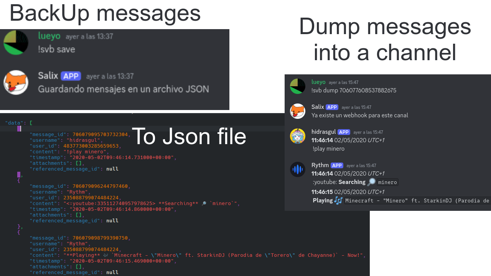
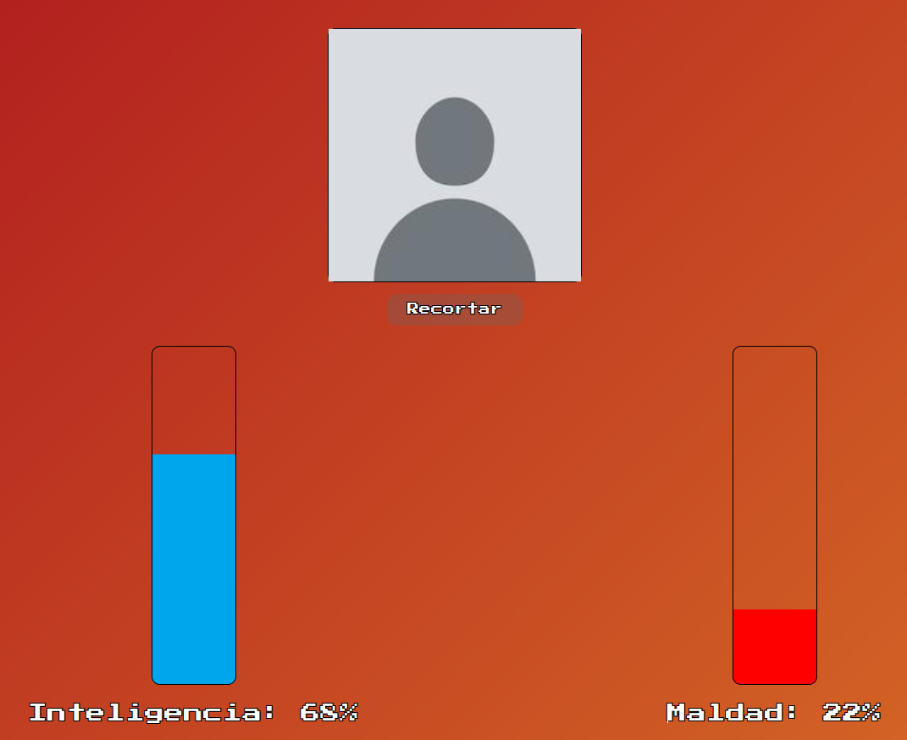
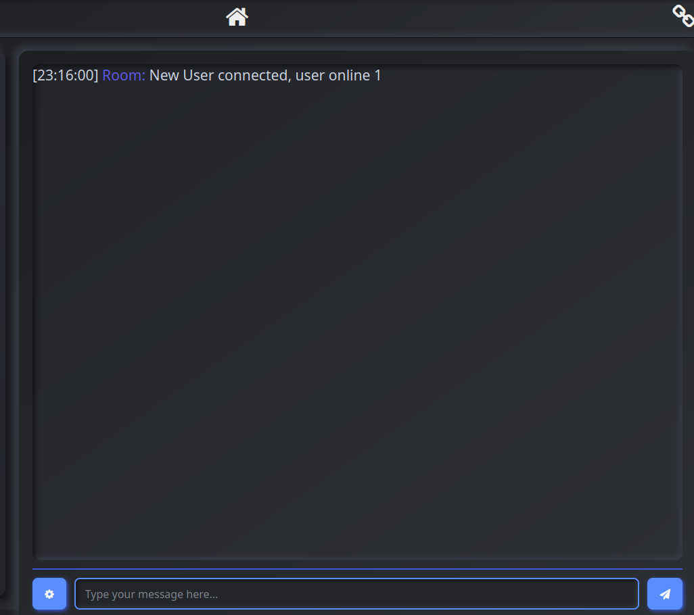

# Hola, soy lueyo 👋

[](https://www.instagram.com/lueyo31/)

### Sobre mi 🙂
```javascript
const user = {
    "name": "Lueyo",
    "username": "lueyo",
    "dateCreated": "19/11/2005",
    "location": "Spain",
    "languages": ["Python", "JavaScript", "HTML", "CSS", "Java", "SQL", "Bash"],
    "technologies": ["Fastapi", "MongoDB", "Discord.py"],
    "tools": ["VS Code", "Git", "Docker", "ThunderClient", "Firefox dev tools"],
    "system": "KDE Neon",
    "website": "https://lueyo.es/",
    "email": "tonisuarez2005@gmail.com",
    "experience": {"Scratch":2013,"Linux": 2018, "Python": 2020},
    "projects": ["DS Menu", "Link Shorter", "Lueyo Notepad", "Bard Trivial", "Fast Thumbnails", "SaveBot"],
    "social": "linktr.ee/lueyo"
}
```
## Tecnologías 🖥️


 
 
 
 


 

 

 
 
 
 

 
 
 
 
 
 


## Logros de github 🏅


[](https://github.com/lueyo/github-readme-stats)
[](https://github.com/lueyo31/github-readme-stats)


  <a href="https://github.com/lueyo/github-readme-stats"></a>
  <br/>

## Mis proyectos

### DS Menu

#### Una copia del menú de la nintendo DS
#####    

<a href="https://ds.lueyo.es/"></a>

### Save Bot
#### Un bot de discord para hacer copias de seguridad de mensajes
#####  

<a href="https://github.com/lueyo/save-discord-messages"></a>

### Link Shorter

#### Un acortador de links desplegado en [Mi Web](https://link-shorter-bymq.onrender.com) 
#####   

<a href="https://github.com/lueyo/link-shorter"></a>

### Fast Thumbnails 
#### Un script que te crea miniaturas, pensado para los extractos de directos poco currados
#####  

<a href="https://github.com/lueyo/Fast-Thumbnails"></a>

### Lueyo Notepad
#### Un bloc de notas para windows hecho en tkinter
##### 

<a href="https://github.com/lueyo/lueyoNotepad"></a>

### Bard Trivial
#### Un trivial que genera las preguntas con la antigua IA de bard, actualmente no funciona
##### 

<a href="https://github.com/lueyo/bardTrivial"></a>

### Medidor
#### Una app con 2 barras para poner la inteligencia y la maldad de una persona subiendo una foto para luego sacar captura y compartirla
#####   

<a href="https://lueyo.github.io/medidor/"></a>

### Lueyo Chat
#### Un chat simple en tiempo real hecho con websockets
#####  

<a href="https://github.com/lueyo/lueyoChat"></a>
